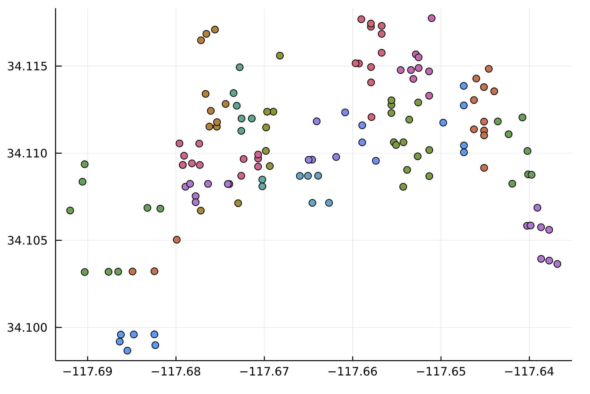
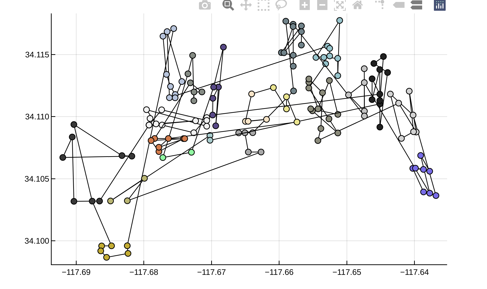
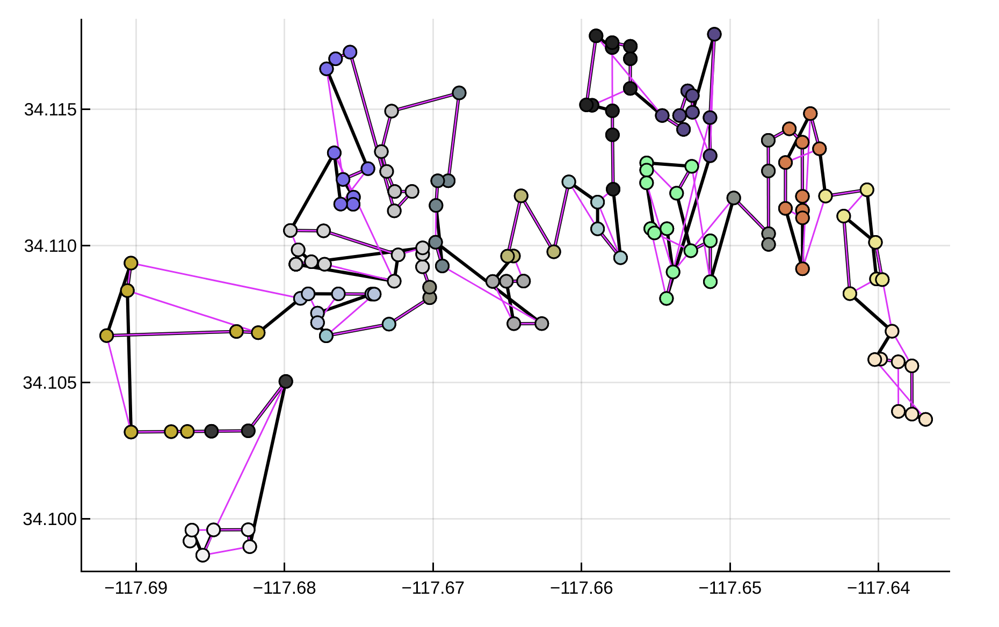

# RC-2021

Amazon-MIT Routing Challenge 2021

- [Nuestros resultados](https://github.com/mforets/RC-2021/blob/master/Resultados.md)

Useful links:

- https://github.com/MIT-CAVE/rc-cli
- https://github.com/MIT-CAVE/rc-cli/tree/main/scoring
- https://github.com/MIT-CAVE/rc-cli/blob/main/templates/data_structures.md#data-field-definitions
- https://routingchallenge.io/
- https://docs.docker.com/engine/install/fedora/

## Obteniendo informacion de la ruta y las paradas

```julia
julia> using RouteSequencing

julia> data_route = parse_route_data();

julia> length(data_route) # numero de rutas
13

julia> R = data_route[1]; # primer ruta

julia> name(R) # nombre de la ruta
"bcc07fea-86d2-41e4-9a58-cfc78956dcc7"

julia> S = stops(R, remove_station=true); # paradas en la ruta, removiendo la estacion

julia> length(S) # numero de paradas en esta ruta

```

## Visualizacion de las paradas de una ruta

```julia
julia> using RouteSequencing, Plots

julia> data_route = parse_route_data();

julia> R = data_route[1]

julia> out = point_cloud(R, remove_station=true);

julia> fig = plot()

julia> [plot!(fig, o, alpha=1.) for o in out]; fig

```



## Visualizacion de una secuencia

```julia
julia> out = path(R, remove_station=true)

julia> [plot!(fig, o, color=:black, seriestype=:path, marker=:none, lw=1.3) for o in out]; fig
```



## Comparacion entre una secuencia actual y una propuesta

```julia
data_route = parse_route_data()
R = data_route[1]

T = parse_travel_times()[1]

S = parse_sequence()[1]
apply_sequence!(R, S) # aplico para que las zonas queden en orden
Q = solve(MinTimeZ(), R, T)

# solucion obtenida
Rsol = deepcopy(R)
apply_sequence!(Rsol, Q)

fig = plot()
plot_sequence!(fig, R, path_color=:black, path_width=2.0) # solucion actual/real
plot_sequence!(fig, Rsol, path_color=:magenta) # solucion obtenida
```



## Obteniendo informacion de la matriz de tiempos

```julia
data_times = parse_travel_times();
```

## Obteniendo informacion de los paquetes

```
data_package = parse_package_data();
```

## Workflow para calcular scores

Para obtener cantidades estadisticas de forma automatica ver el script en el archivo [Results.md](https://github.com/mforets/RC-2021/blob/master/Resultados.md#evaluation-script).

```julia
using RouteSequencing

# cargar datos de travel times
travel_times_json = joinpath("..", "..", "data", "model_apply_inputs", "new_travel_times.json")
travel_times_data = read_json(travel_times_json);
data_times = parse_travel_times(travel_times_data);

# cargar datos de rutas
data_json = joinpath("..", "..", "data", "model_apply_inputs", "new_route_data.json");
route_data = read_json(data_json)
data_route = parse_route_data(route_data);

# elegir la ruta para trabajar
route = data_route[1]
times = data_times[1];

# aplicar el algoritmo
out = solve(MinTimeZ(), route, times);

# obtener el score
get_score(out)
```

## Tiempos de acuerdo a la zona

```julia
julia> using RouteSequencing

# cargar la primer ruta de las 13 de prueba
julia> R = parse_route_data()[1];

julia> name(R)
"bcc07fea-86d2-41e4-9a58-cfc78956dcc7"

# cargar las secuencias actuales/exactas
julia> S = parse_sequence()[1];

# reordenar R de acuerdo a S
julia> apply_sequence!(R, S);

# mostrar las 5 primeras zonas recorridas (sin incluir la station)
julia> zones(R, remove_station=true)[1:5]
5-element Vector{String}:
 "H24.2C"
 "H24.1C"
 "H24.1B"
 "H24.2B"
 "H24.3B"

# indices en el vector de rutas de acuerdo a la zona
julia> zoneidx, _, _ = split_by_zone(R);

julia> zoneidx[1]
6-element Vector{Int64}:
 1
 2
 3
 4
 5
 6
 
# tomar los nombres de las paradas 2 a 7 (primera zona)
julia> stopnames = [name(s) for s in R.stops[2:7]]
6-element Vector{String}:
 "LZ"
 "ZT"
 "ZI"
 "YC"
 "WZ"
 "HS"
 
# cargar la matriz de tiempos de la primer ruta
julia> T = parse_travel_times()[1].travel_times;

# seleccionar solamente la submatriz que consiste en las paradas 2 a 7 en la ruta ordenada
julia> M = view(T, stopnames, stopnames)
6×6 Named SubArray{Float64, 2, Matrix{Float64}, Tuple{Vector{Int64}, Vector{Int64}}, false}
A ╲ B │    LZ     ZT     ZI     YC     WZ     HS
──────┼─────────────────────────────────────────
LZ    │   0.0   29.1  220.8   49.7   74.7  119.3
ZT    │  38.9    0.0   66.3   20.5   45.5   90.1
ZI    │ 223.6   75.5    0.0   68.0   93.0  137.6
YC    │  55.4   19.1   77.4    0.0   24.9   69.5
WZ    │  80.5   44.2  102.5   25.0    0.0   44.5
HS    │ 137.4  101.1  159.4   81.9   56.8    0.0
```


## Calculando scores (detalles)

A continuación describimos el procedimiento para usar las funciones de scoring desde Python.

### Preparacion

1. Ir al directorio adecuado y abrir Python.

```python
$ pwd
/home/mforets/Projects/RC-2021/RouteSequencing

$ python
Python 3.7.6 (default, Jan 30 2020, 09:44:41)
[GCC 9.2.1 20190827 (Red Hat 9.2.1-1)] on linux
Type "help", "copyright", "credits" or "license" for more information.
>>>
```

2. Cargar el modulo `py_scoring`.

```python
>>> import py_scoring

>>> from py_scoring.score import *
```

### Calculando el score total

El procedimiento consiste en convertir los JSON a diccionarios de Python, luego llamar a la funcion
`evaluar_score`, que evalua el score de cada ruta y saca el promedio de scores.

```python
>>> evaluar_score()
0.0
```

En la funcion anterior los path estan hard-codeados; los pasos son:

```python
>>> inputs_src = "../data/model_apply_inputs/"
>>> submission_src = "../data/model_apply_outputs/"

>>> actual_routes_json = inputs_src + "new_actual_sequences.json"
>>> submission_json = submission_src + "proposed_sequences.json"
>>> cost_matrices_json = inputs_src + "new_travel_times.json"
>>> invalid_scores_json = inputs_src + "new_invalid_sequence_scores.json"

>>> resultado = evaluate(actual_routes_json, submission_json, cost_matrices_json, invalid_scores_json);

>>> resultado['submission_score']
```

### Calculando el score de una única ruta

Para evaluar el score de una unica ruta usamos la funcion `score_route(actual, sub, cost_mat, route_id)`, donde los argumentos
son diccionarios de Python. Por ejemplo:

Se pasa `route_id` que es el nombre de la ruta.

```python
>>> from py_scoring.score import score_route_id

>>> score_route_id(route_name)
```

En esa funcion los path estan hardcodeados; los pasos que hace esa funcion eson:

```python
>>> actual = read_json_data(actual_routes_json)
>>> sub = read_json_data(submission_json)
>>> cost_mat = read_json_data(cost_matrices_json)

>>> route_names = list(actual);
>>> route_id = route_names[0];  # elijo la ruta que quiero evaluar

>>> score_route(actual, sub, cost_mat, route_id)
```
